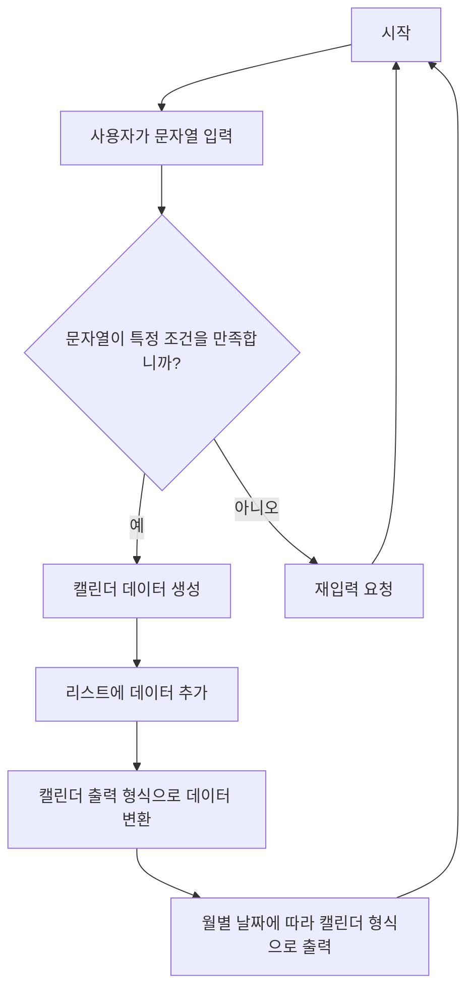
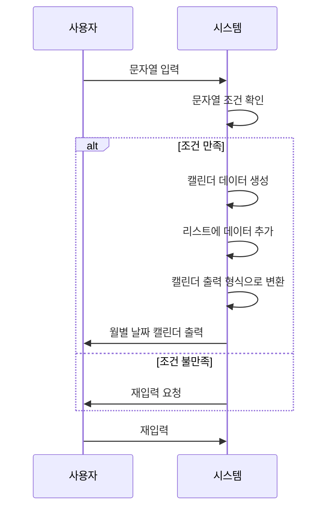
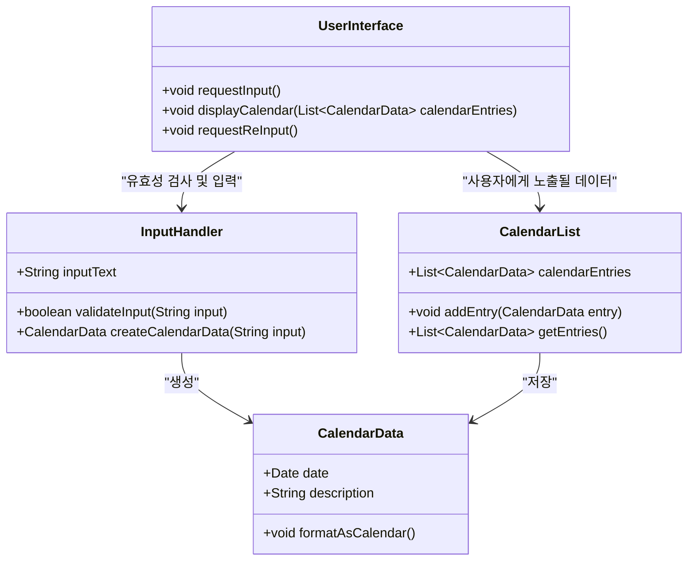
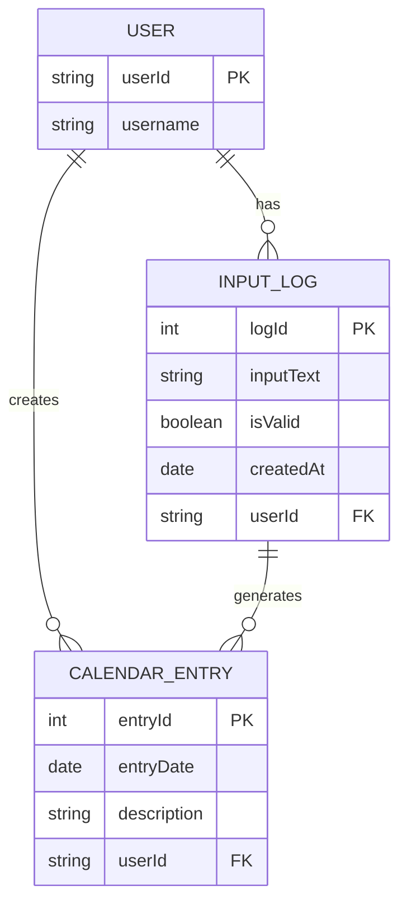

# 🔴 Simol Calendar Project

## 🟠 실행

### 🟢 calendar-api

1. root 프로젝트 경로에서 ./gradlew clean build
1. calendar 프로젝트 경로에서 java -jar ./build/libs/\*.jar 파일 실행

## 🟠 설계

### 🟢 요구사항

1. 특정 문자열로 입력시 자동으로 캘린더 데이터로 생성
1. 입력한 내용은 리스트로 출력
1. 캘린더처럼 월 날짜별로 출력

### 🟢 flow-chart (흐름도)

### 🟢 Sequence Diagram (시퀀스 다이어그램)

### 🟢 Class Diagram

### 🟢 ERD

